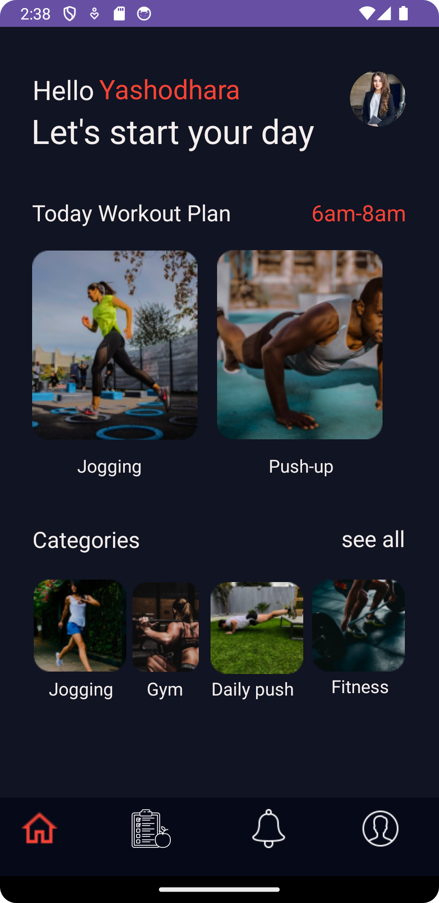
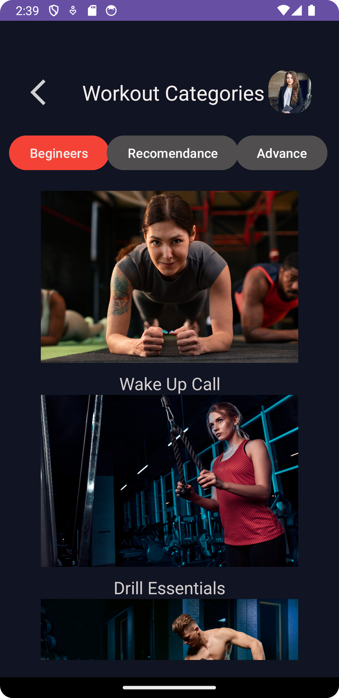
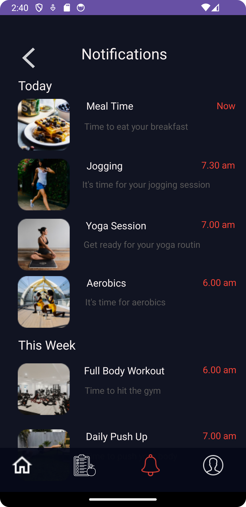
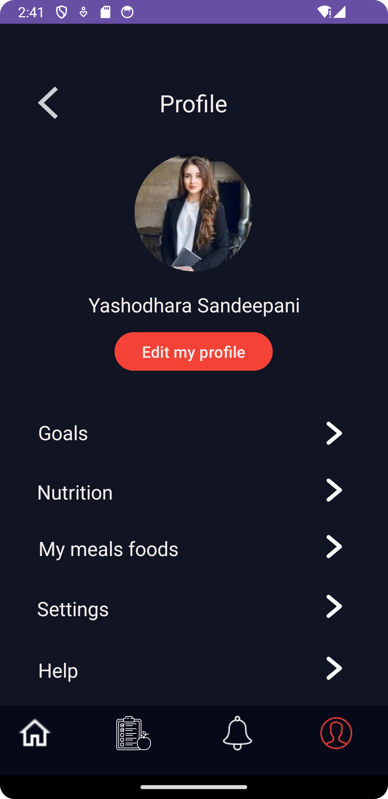
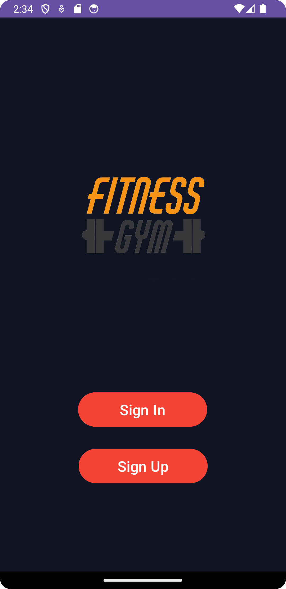

# Body Goals Workout App

## Description
Body Goals Workout is a comprehensive fitness app designed to help users achieve their fitness goals through tailored workout plans and diet recommendations.

## How to Use
1. **Sign In/Sign Up**: Users can create an account or sign in to their existing account.
2. **Profile Setup**: Set up your profile with personal fitness goals.
3. **Workout Plans**: Choose workout categories based on your fitness level.
4. **Diet Plans**: Follow the recommended diet plans for balanced nutrition.
5. **Notifications**: Stay updated with workout and meal reminders.
6. **Progress Tracking**: Monitor your progress and adjust plans as needed.

## Screenshots

| Onboarding                            | Home                                    | Workout Categories                    |
|---------------------------------------|-----------------------------------------|---------------------------------------|
|  |        |  |

| Diet Plan                             | Notifications                           | Profile                               |
|---------------------------------------|-----------------------------------------|---------------------------------------|
|  |  |  |

| Sign In                               | Sign Up                                 | Get Started                           |
|---------------------------------------|-----------------------------------------|---------------------------------------|
|  |     |  |

| Welcome                               |
|---------------------------------------|
|    |

## Instructions
- **Sign In/Sign Up**: Create or access your account.
- **Profile**: Update your profile with personal goals and preferences.
- **Workout Categories**: Select workouts suitable for your level - Beginners, Intermediate, or Advanced.
- **Diet Plan**: Follow the diet recommendations for Breakfast, Lunch, and Dinner.
- **Notifications**: Enable notifications to get timely reminders for workouts and meals.
- **Track Progress**: Regularly monitor your progress and make adjustments to your plans as necessary.

## Features
- Personalized workout and diet plans
- Progress tracking and performance insights
- Notifications for workouts and meals
- User profile with editable goals
- Secure authentication

## Contact
For any issues or feedback, please contact us at support@bodygoalsworkout.com.
